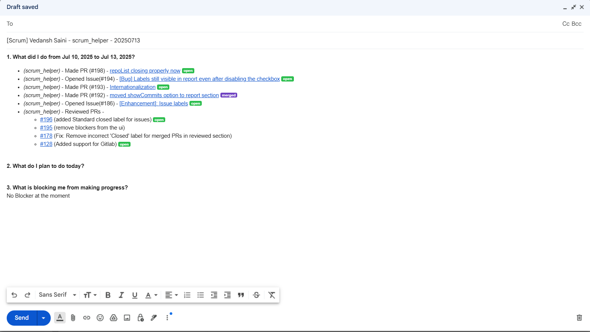
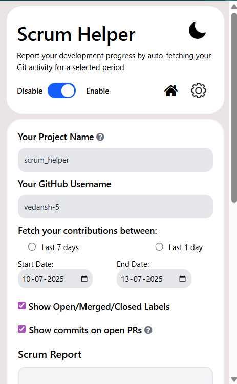
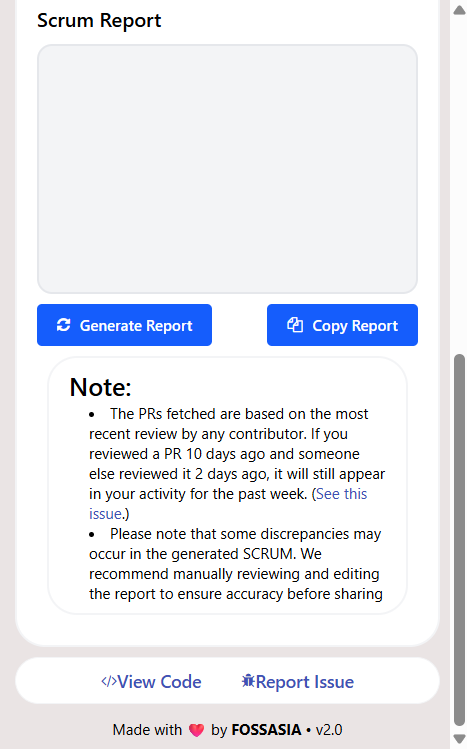
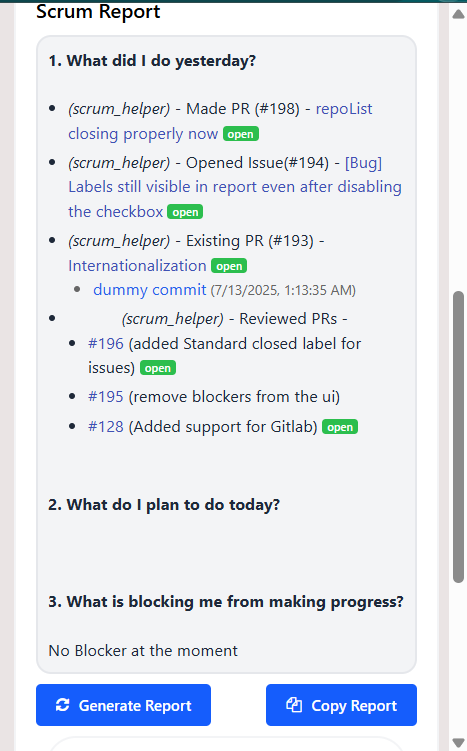
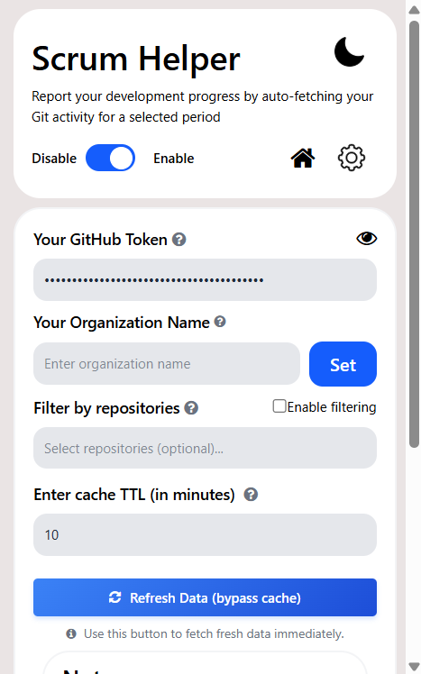

# Scrum Helper

**Scrum Helper** is a Chrome extension that simplifies writing development reports by auto-filling content based on your Git activity. Just enter your GitHub username, select a date range, and choose your preferences, the extension automatically fetches your commits, pull requests, issues, and code reviews via the GitHub API and generates a pre-filled report that you can edit as needed. While currently focused on Git-based workflows, Scrum Helper is designed to expand to other platforms in the future.


## Features

- Automatically fetches your Git activity, including commits, pull requests, issues, and code reviews.
- Currently supports GitHub, with plans to expand to other platforms
- Generates editable scrum updates based on your selected date range
- Integrates directly with compose windows in Google Groups, Gmail, Yahoo Mail, and Outlook

## How to install

### For Chrome:

1. Clone this repository to your local machine.
2. Go to `chrome://extensions` on your chrome browser.
3. Enable Developer Mode (toggle in the top-right) if not already.
4. Click Load unpacked and select the `src` folder inside the cloned repo
5. Click the Scrum Helper icon on your browser toolbar
6. Fill in your settings in the popup (GitHub username, date range, etc.)

<!-- ### For Firefox:

1. Clone this repository to your local machine.
2. Open Firefox and navigate to `about:debugging`
3. Click on "This Firefox" in the left sidebar
4. Click "Load Temporary Add-on..."
5. Navigate to the `src` folder inside the cloned repo and select the `manifest.json` file
6. The extension will be loaded temporarily and will remain active only for the current browser session
7. Click the Scrum Helper icon on your browser toolbar
8. Fill in your settings in the popup (GitHub username, date range, etc.)

**Note for Firefox users:** The extension will be automatically removed when you close Firefox. You'll need to reload it each time you start a new browser session by repeating steps 2-5.

**Persistence Note:** If you need the extension to persist between sessions, use Firefox Developer Edition. You can enable persistence by setting `xpinstall.signatures.required` to `false` in the browser's configuration. -->

## Usage

### For Google Groups:

- Open Google Groups New Topic
- Start a New Conversation
- Refresh the page to apply the Scrum Helper settings
- Use the pre-filled scrum and edit as needed

### For Gmail, Yahoo, and Outlook:

- Open the Compose window.
- Ensure the Scrum Helper settings are applied (follow step 6 above)
- The extension will prefill scrum content for you to edit

### New Features

1. **Standalone Popup Interface**
   - Generate reports directly from the extension popup
   - Live preview of the report before sending
   - Rich text formatting with clickable links
   - Copy report to clipboard with proper formatting

### Usage Standalone
- Click on `GENERATE` button to generate the scrum preview.
- Edit it in the window.
- Copy the rich HTML using the `COPY` button.

## Setting up the code locally

```
$ git clone https://github.com/fossasia/scrum_helper/
$ cd scrum_helper
$ npm install
```

## Screenshots











## Using Scrum Helper with Your Own GitHub Organization

Scrum Helper is not limited to the [FOSSASIA](https://github.com/fossasia) organization. You can easily configure it to fetch and generate SCRUM reports for your own GitHub organization or repositories.

### Steps to Set It Up for Your Organization

1. **Install the Extension**

* For Chrome: Load it into your browser through [Chrome Extension Developer Mode](https://developer.chrome.com/docs/extensions/mv3/getstarted/).
* For Firefox: Load it as a temporary add-on through `about:debugging` as described above.

2. **Update the Organization**
   * Currently, the extension uses `org:fossasia` to fetch GitHub issues and PRs.
   * To make it work with your GitHub organization:
     * Open `scrumHelper.js` (or wherever the GitHub API URLs are defined).
     * Replace:

       ```js
       +org:fossasia+
       ```

       with:

       ```js
       +org:your-org-name+
       ```

       **Example**
       

3. **Build the Extension**
   * Save your changes.
   * For Chrome: Rebuild or reload the extension in your browser (`chrome://extensions` → Refresh your extension).
   * For Firefox: Reload the temporary add-on by going to `about:debugging` → "This Firefox" → Click "Reload" next to your extension.
4. **Get Customized SCRUM Reports**
   - The reports will now be generated using contributions from your organization.


## About contributing

- Follow the Issues and PRs templates as far as possible.
- If you want to make a PR, please mention in the corresponding issue that you are working on it.
- Before making a PR, ensure your code is properly formatted and linted:
  - Format your code: This command automatically formats your code based on the project's style guidelines.
    ```sh
    npm run format
    ```
  - Check for issues: This command runs the formatter, linter, and import sorting on the requested files to enforce coding standards.
    ```sh
    npm run check
    ```
  - Fix linting errors: If the linter detects fixable issues, this command will automatically apply the necessary corrections.
    ```sh
    npm run fix
    ```
- If you encounter any bugs, please report them at the [Issues page](https://github.com/fossasia/scrum_helper/issues).
